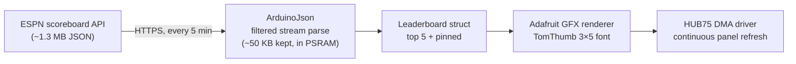

# ⛳ Golf Live Update

**A live PGA Tour leaderboard on a 64×64 RGB LED matrix, powered by an ESP32-S3.**

Shows the tournament name, current round, the top 5, and your favourite golfers —
refreshed straight from ESPN every 5 minutes. No backend, no API key, no subscriptions.

```
┌────────────────────┐
│ WYNDHAM CHMP    R3 │  ← tournament + round
│ ────────────────── │
│ 1  SCHEFFLER -14 F │
│ 2  MCILROY   -11 15│  ← top 5 leaders
│ 3  RAHM      -10 12│     red = under par
│ 4  MORIKAWA   -8 F │     thru column: holes played
│ 5  FLEETWOOD  -7 16│
│ ────────────────── │
│ T23 ABERG     -2 9 │  ← your pinned golfers
└────────────────────┘  ● status dot: green = fresh
```

---

## 🛒 Bill of materials

| Part | Notes | Link |
|------|-------|------|
| 64×64 RGB LED matrix, P2, HUB75 | 128×128 mm, 1/32 scan | [Electrokit](https://www.electrokit.com/en/full-color-panel-2mm-rgb-led-matrix-64x64px-128x128mm-p2) |
| ESP32-S3 mini dev board | 4 MB flash / 2 MB PSRAM, 16 GPIO on headers | [Electrokit](https://www.electrokit.com/esp32-s3-utvecklingskort-mini-4mb-psram-2mb-med-headers) |
| 5 V power supply, ≥ 4 A | Powers the panel directly — **not** through the dev board | any quality 5 V/4 A PSU |
| Female–female dupont wires ×16 | Panel usually ships with an IDC data cable + power harness | — |

> **Why ESP32-S3 and not C5/C6?** HUB75 panels have no framebuffer — the MCU must
> re-stream the whole image 100+ times/second via DMA. The S3's LCD peripheral is
> what the battle-tested [ESP32-HUB75-MatrixPanel-DMA](https://github.com/mrcodetastic/ESP32-HUB75-MatrixPanel-DMA)
> library is built on. The C5 has no official support in any HUB75 library (as of 2026).

---

## 🔌 Wiring

The panel's **data-in** connector (HUB75-E, 2×8 pins) hooks to the ESP32-S3 like this.
All pins are configurable in [`include/config.h`](include/config.h).

```
   HUB75-E connector (looking at the BACK of the panel, data-IN side)

        ┌───────────┐
    R1  │ ●1     2● │  G1
    B1  │ ●3     4● │  GND
    R2  │ ●5     6● │  G2
    B2  │ ●7     8● │  E
    A   │ ●9    10● │  B
    C   │ ●11   12● │  D
    CLK │ ●13   14● │  LAT
    OE  │ ●15   16● │  GND
        └───────────┘
```

| HUB75 signal | ESP32-S3 GPIO | | HUB75 signal | ESP32-S3 GPIO |
|:---:|:---:|---|:---:|:---:|
| R1 | 1 | | A | 7 |
| G1 | 2 | | B | 8 |
| B1 | 3 | | C | 9 |
| R2 | 4 | | D | 10 |
| G2 | 5 | | E | 11 |
| B2 | 6 | | CLK | 12 |
| LAT | 13 | | OE | 43 |
| GND | GND | | | |

**Power — read this once, save yourself a smoked board:**

- Feed the panel's screw/spade power terminals **directly from the 5 V PSU**.
  A 64×64 P2 panel can pull ~4 A at full white — far beyond what the dev board's
  5 V pin or USB port can supply.
- Connect **PSU GND ↔ panel GND ↔ ESP32 GND** (common ground, always).
- The dev board itself can run off USB, or off the same PSU's 5 V into its 5V pin.
- At the default brightness (90/255) the panel draws well under 2 A.

---

## 🚀 Getting started

1. **Install [PlatformIO](https://platformio.org/)** (VS Code extension or `pipx install platformio`).

2. **Clone & configure:**

   ```bash
   git clone git@github.com:johankitti/golf-live-update.git
   cd golf-live-update
   cp include/secrets.h.example include/secrets.h
   # edit include/secrets.h with your Wi-Fi credentials
   ```

3. **Pick your golfers** in [`include/config.h`](include/config.h):

   ```cpp
   static const char* const PINNED_GOLFERS[] = {
       "Aberg",        // matches "Ludvig Åberg" (accents are folded)
       "Noren",        // up to 3 fit below the leaders
   };
   ```

4. **Build & flash** (board connected over USB):

   ```bash
   pio run -t upload          # ESP32-S3 mini (default)
   pio run -e devkitc -t upload   # full-size DevKitC instead
   pio device monitor         # watch the logs
   ```

That's it. The board connects to Wi-Fi, pulls the leaderboard, and refreshes
every 5 minutes (configurable via `UPDATE_INTERVAL_MS`).

---

## ⚙️ How it works



- **Data source:** ESPN's public, keyless endpoint
  [`site.api.espn.com/.../golf/pga/scoreboard`](https://site.api.espn.com/apis/site/v2/sports/golf/pga/scoreboard).
- **The 1.3 MB problem:** the response is far bigger than the chip's RAM. The firmware
  streams it through [ArduinoJson's filter](https://arduinojson.org/v7/api/json/deserializejson/)
  so only ~a dozen fields per player are ever kept (in PSRAM).
- **Display:** [ESP32-HUB75-MatrixPanel-DMA](https://github.com/mrcodetastic/ESP32-HUB75-MatrixPanel-DMA)
  refreshes the panel via DMA with zero CPU load between updates;
  [Adafruit GFX](https://github.com/adafruit/Adafruit-GFX-Library) draws the text.
- **Names on a tiny font:** the LED font is ASCII-only, so names are accent-folded
  (`Åberg → ABERG`) before rendering.
- **Resilience:** failed fetches retry after 30 s while the last good leaderboard stays
  up; the bottom-right dot turns red so you know it's stale. Wi-Fi drops reconnect
  automatically. Off weeks show a friendly "OFF WEEK" screen.

---

## 🧰 Troubleshooting

| Symptom | Fix |
|---------|-----|
| Panel black or garbage pixels | Uncomment `cfg.driver = HUB75_I2S_CFG::FM6126A;` in `src/display.cpp` — many panels use FM6126A driver chips |
| Colors swapped (red ↔ blue) | Swap the R1/B1 and R2/B2 pin numbers in `config.h` |
| Only half the panel lights up | E address line not connected/wrong pin — 64 px panels need A–E |
| Flicker or ghosting | Shorten wires; try `cfg.clkphase = false;` |
| `DMA init failed` in the serial log | A configured GPIO doesn't exist on your board — adjust `config.h` |
| No serial output | Logs go over native USB (`ARDUINO_USB_CDC_ON_BOOT=1`) — use the board's USB port, `pio device monitor` |

---

## 📄 License

MIT — do whatever you like, a ⭐ is always nice.
